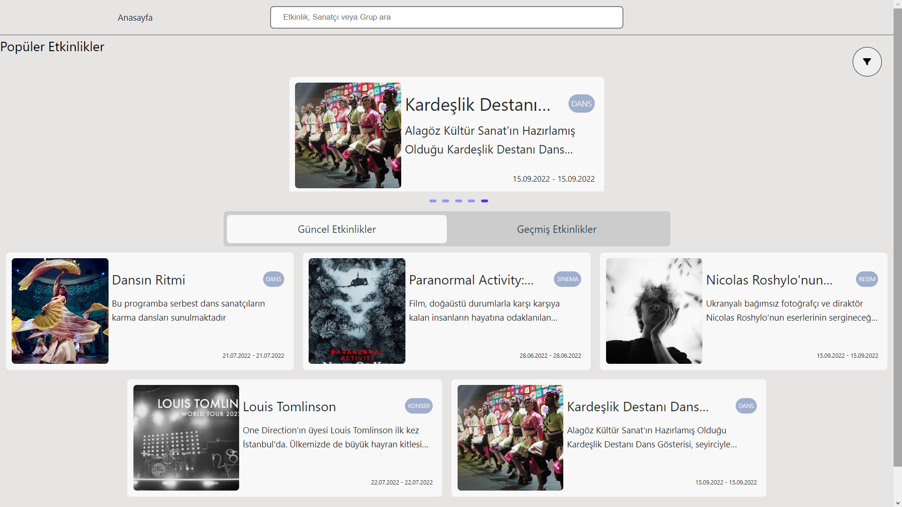
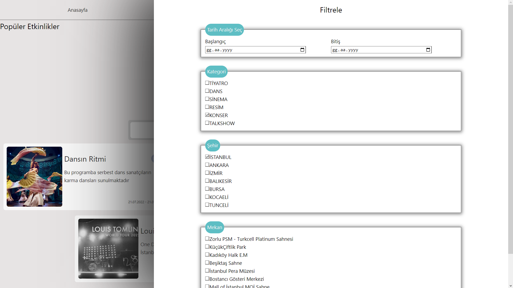
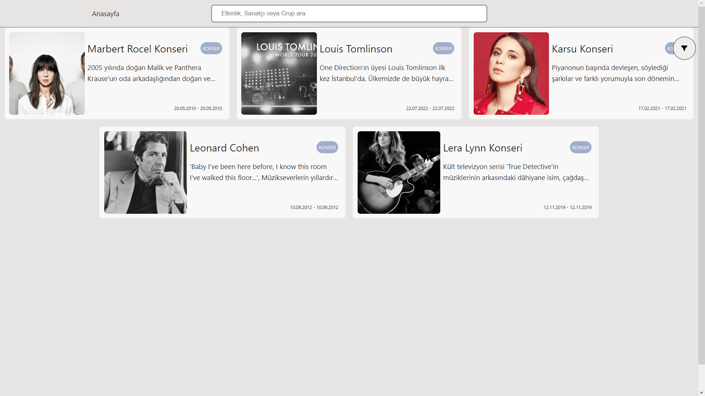
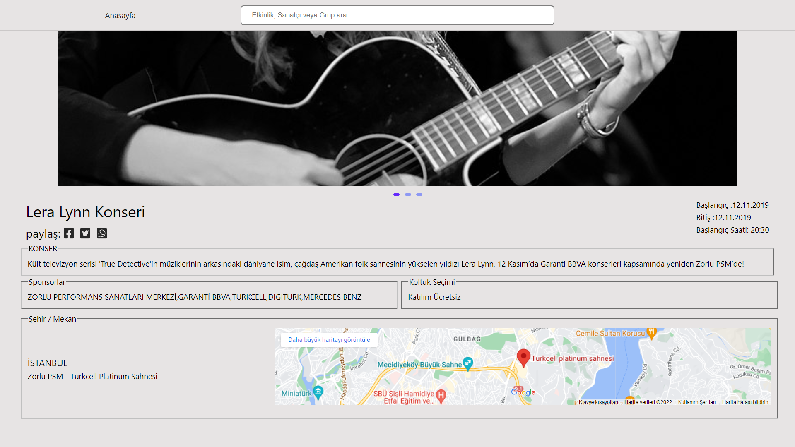

## Projem iki kısımdan oluşmakta Frontend ve Backend

proje boyutu çok fazla olduğundan node_module'leri sildim o yüzden projeyi indirdikten sonra aşağıdaki işlemleri yapmalısınız
sırasıyla Frontend klasörüne girip 
> npm install  

kodunu çalıştırınki paketleri yükleyin  

ardından Backend klasörüne girip 
> npm install  

kodunu çalıştırınki buradaki paketleride yüklesin 

tamadır paketler yüklendiyse şimdi çalıştırma kısmına gelelim  
ilk başta backend serverini çalıştıralım ki yapılan istekler cevap bulabilsin bunun için  
backend klasörüne girip aşağıdaki kodu çalıştırın;
> npm run app

böylece serverimiz çalışıyor olucak  

şimdide frontend klasörüne girip aşağıdaki kodu çalıştıralım
> npm run dev

böylece projemiz ayağa kalmış olucaktır

##Projemden görüntüler  

